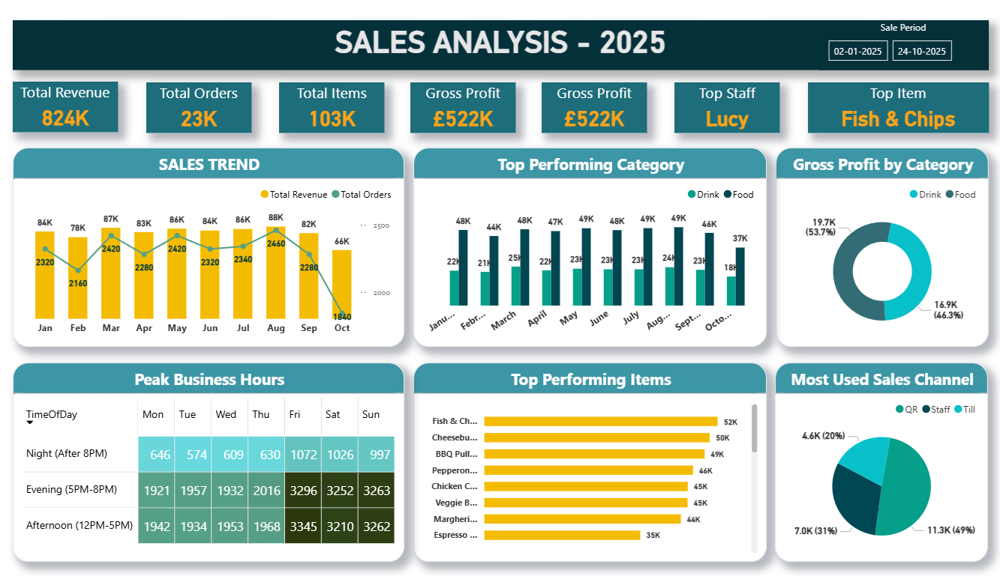

# Retail Sales Analysis Dashboard (2025)

## 📊 Project Overview
This project showcases a **Retail Sales Analysis Dashboard** created using **Microsoft Power BI**.  
It visualizes sales performance for a restaurant-style business offering both **food and drinks**.  
The dataset used is **simulated** and designed for learning and demonstration purposes only.

---

## 🎯 Objectives
- Analyze overall revenue, orders, and profit performance.  
- Compare **food vs drink** sales categories.  
- Identify **top-performing items and staff**.  
- Track **peak business hours** and **most used sales channels**.  
- Turn data into actionable insights for business decisions.

---

## 🖼️ Dashboard Preview
Below is the image of the dashboard:

---

## 📈 Key Insights
The **Retail Sales Analysis Dashboard (2025)** provides a complete view of sales performance across food and drink categories.  
Key findings include:

### 🔹 Overall Business Performance
- **Total Revenue:** £824K  
- **Total Orders:** 23K  
- **Total Items Sold:** 103K  
- **Gross Profit:** £522K (approx. 63% profit margin)

➡️ Consistent profitability and strong demand across the year.

### 🔹 Monthly Sales Trend
- **Peak Month:** August (£88K)  
- **Lowest Month:** October (£66K)  
- Stable performance through most months with a minor Q4 dip.

### 🔹 Category Performance
- **Drinks:** 53.7% of total profit  
- **Food:** 46.3% of total profit  
- Balanced performance between both categories.

### 🔹 Top Performers
- **Top Item:** Fish & Chips (£52K)  
- **Top Staff:** Lucy  
- Other strong items: Cheeseburger, BBQ Pulled Burger, Espresso.

### 🔹 Peak Business Hours
- Busiest times: **Afternoon (12PM–5PM)** and **Evening (5PM–8PM)**.  
- **Friday & Saturday evenings** drive the most sales.

### 🔹 Sales Channels
- **Staff orders:** 49%  
- **Till:** 31%  
- **QR orders:** 20%  
➡️ Opportunity to promote digital (QR) ordering for convenience.

---

📊 *This project demonstrates how Power BI transforms simulated sales data into meaningful business insights.*

